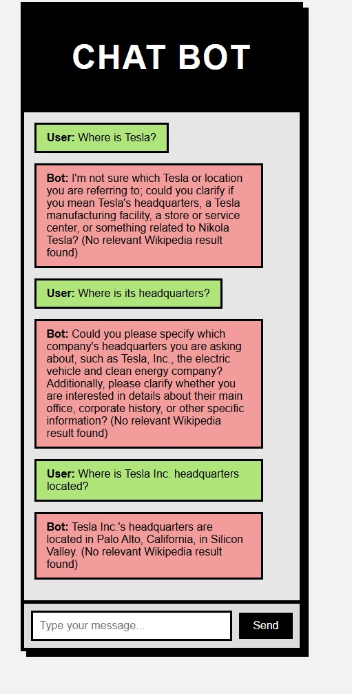

# Maxitech Entrepeer Take Home Assignment

## Introduction
This is a take home assignment for the AI Engineer role at Maxitech Entrepeer. 
The assignment is to build a simple web application 
that allows users to chat with a chatbot and retrieve documents from Wikipedia or Web Search. 
The application should be built using the FastAPI web framework and the LangGraph framework.

## Requirements
- Python 3.12 (Optional for local development)
- Docker Engine ≥ 20.10
- Docker Compose ≥ 2.17
- FastAPI
- LangGraph
- Wikipedia API
- Web Search API
- Libraries:
  - fastapi>=0.100.0
  - uvicorn>=0.22.0
  - langchain>=0.0.260
  - langchain-openai>=0.0.148
  - langgraph>=0.2.74
  - langserve>=0.0.1
  - python-dotenv>=1.0.0
  - scikit-learn>=1.2.2
  - requests>=2.31.0
  - beautifulsoup4>=4.12.2
  - pydantic>=2.0.0
  - jinja2>=3.1.2
  - python-multipart>=0.0.5

### Requirements Explanation
- Python 3.12: For the programming language Python was picked due to requirement of the project. This version was picked
due to its speed compared to Python 3.10. Also, Python 3.12 has better exception tracking compared to Python 3.10.
- FastAPI: FastAPI is a modern web framework for building APIs with Python 3.6+ based on standard Python type hints.
- LangGraph: LangGraph is a framework for building conversational AI applications. It is built on top of FastAPI and
provides a simple way to build conversational AI applications.
- Wikipedia API: Wikipedia API is used to retrieve documents from Wikipedia.
- Tavily API: Tavily API is used to retrieve documents from the web.

## Branch Structure
- master: The main branch of the project. This branch is used for production releases.
- feature: The feature branch of the project. This branch is used for developing new features. Subbranches of this branch are created for each feature.
- hotfix: The hotfix branch of the project. This branch is used for fixing bugs in the production code.

## Project Structure
src/graph -> Contains the graph structure of the project. This structure is used to build the conversational AI.
tests/api-tests -> Contains the api tests of the project.
tests/unit-tests/graph -> Contains the graph tests of the project.
test3.py -> The first iteration of the graph

## Installation
1. Clone the repository
```bash
git clone https://github.com/theFellandes/Maxitech-Interview.git
cd Maxitech-Interview
```
2. Install the dependencies
```bash
# For local development (optional)
python -m venv venv
source venv/bin/activate  # Linux/Mac
# venv\Scripts\activate  # Windows
pip install -r requirements.txt

# For Docker setup (required)
docker-compose build
```
3. Run the application
```bash
# Clean previous builds (if any)
docker-compose down -v --remove-orphans
docker system prune -a --volumes -f

# Build the application
docker build -t langgraph-app .

# Start application
docker run -p 8000:8000 langgraph-app

```
4. Check if the application is installed correctly
```bash
# Check container status
docker-compose ps

# Verify Python environment
docker-compose exec web python -c "import sys; print(sys.path)"
# Should show: ... '/app' ...

# Confirm file structure
docker-compose exec web ls -l /app/src/app/
# Expected output:
# total 8
# -rw-r--r-- 1 root root 0 Feb 14 21:13 __init__.py
# -rw-r--r-- 1 root root 78 Feb 14 21:13 main.py

# Test FastAPI imports
docker-compose exec web python -c "from src.app.main import app; print(f'Success! FastAPI app: {app}')"
# Should show: Success! FastAPI app: <FastAPI(...)>
```
5. Additional Commands
```bash
# View logs
docker-compose logs -f web

# Run tests (if configured)
docker-compose exec web pytest tests/

# Clean shutdown
docker-compose down -v --remove-orphans
```

## Endpoints
/ -> The main endpoint of the application. This endpoint is used to open up the UI.
/chat -> The chat endpoint of the application. This endpoint is used to interact with the chatbot.

## Usage
1. Open the application in your browser
```bash
http://localhost:8000
```
2. Type your message in the input box and press enter to send the message to the chatbot.
3. The chatbot will respond with a message.
4. If you want to retrieve a document, type `/chat: <query>` and press enter.

## State Diagram

In this project, I took aspirations from Self-RAG and Adaptive RAG models. I used the LangGraph framework to build the conversational AI.

In the earliest stages of the project, I've made this graph using Adaptive RAG:


First iteration state diagram as follows:


Second iteration state diagram as follows:


 
The final state diagram as follows:


## UI Design

The following image was the first draft of the UI design. The design was later changed to a more user-friendly design. 
I prefer neobrutalist approach to UI design. That's why the design was improved to a more neobrutalist design.


This design was later improved to the following design. The design is more user-friendly and easier to use. It featured
neobrutalist design elements and a more user-friendly color scheme.



## Monitoring

I've used LangSmith for the monitoring and this screenshot shows the monitoring of the application.


## Authors
- [Oğuzhan Güngör](https://github.com/theFellandes/)

## Special Thanks
- My Family -> For supporting me during the project and putting up with me during the stressful times of the project.
